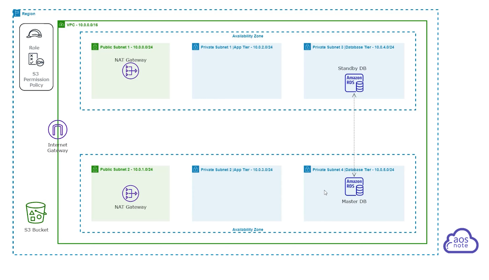

## Nigerian scrapper Azeez Salu
https://github.com/azeezsalu

Argh this is 14 videos-- but we can skip a whole bunch of them

VPC load balancing RDS EC2
10 .tf files

- [ ] [How to Install Terraform on a Windows Computer](https://www.youtube.com/watch?v=8uxxf2HoAX0)
- [ ] [How to Install Visual Studio Code on a Windows Computer](https://www.youtube.com/watch?v=S2RvmFMFjRs)
- [ ] [How to Create an IAM User with Programmatic Access.](https://www.youtube.com/watch?v=5YnTstk3RxM)
- [ ] [How to Install the AWS Command Line (CLI) on a Windows Computer](https://www.youtube.com/watch?v=Gc4KKVWl6TI)
- [x] [Terraform File Structure](https://www.youtube.com/watch?v=6P5LjvrhiJc)
- [ ] [How to Authenticate Terraform with AWS Provide](https://www.youtube.com/watch?v=_TPIs6iG71I&list=PL184oVW5ERMDGN0a7yowSQiH4qjsTeE5g&index=10)
- [x] [Use Terraform Module to Build a 3 Tier AWS Network VPC](https://www.youtube.com/watch?v=ZP_vAbjfFMs&list=PL184oVW5ERMCxA4336x_TM7q1Cs8y0x1s&index=6)
- [x] [Use Terraform Module to Create Nat Gateways](https://www.youtube.com/watch?v=PWoXb9MONrU&list=PL184oVW5ERMCxA4336x_TM7q1Cs8y0x1s&index=7)
- [x] [Use Terraform Module to Create Security Groups](https://www.youtube.com/watch?v=oohXRXjahFA&list=PL184oVW5ERMCxA4336x_TM7q1Cs8y0x1s&index=8)
- [ ] [How to Create an RDS Database Using Terraform (Version 0.11 and earlier)](https://www.youtube.com/watch?v=Qb34X78yNLs&list=PL184oVW5ERMDGN0a7yowSQiH4qjsTeE5g&index=14)
- [ ] [Launching an RDS Instance Using Terraform](https://www.youtube.com/playlist?list=PL184oVW5ERMDGN0a7yowSQiH4qjsTeE5g)
- [ ] The next is from a different playlst that shares a bunch of the previous vids
- [x] [How to Create ECS Task Execution Role with Terraform Modules](https://www.youtube.com/watch?v=vEfAFVDguko)
- [x] [How to Request an SSL Certificate from AWS Certificate Manager with Terraform Modules](https://www.youtube.com/watch?v=RRdYFwlCHic)
- [x] [How to Create Application Load Balancer Using Terraform Modules](https://www.youtube.com/watch?v=1OYONBN2jgE)

 -->


### Terraform File Structure
#### resource
* ```resource``` is a kind of object. The first term after  resource is a known terraform object. 
* Search to find the details. You are looking for a Terraform Registry page
  * [aws_vpc](https://registry.terraform.io/providers/hashicorp/aws/latest/docs/resources/vpc.html) is found here, and gives several examples from basic usage to specifying every detail. 
    * For example (2nd example from that page )
```.tf
resource "aws_vpc" "main" {
  cidr_block       = "10.0.0.0/16"
  instance_tenancy = "default"

  tags = {
    Name = "main"
  }
}
  ```

  * The second value is the local name
  * To reference any thing just connect resource.name
    * ```aws_vpc.main.id``` for example
  #### data
  * A terraform managed data source. search ```data source <name>```
  * [aws_availability_zones](https://registry.terraform.io/providers/hashicorp/aws/latest/docs/data-sources/availability_zones)


### Use Terraform Module to Build a 3 Tier AWS Network VPC
This one is over an hour, set video speed 
Creating
  * jupiter-website-ecs
    * [backend.tf](./jupiter-website-ecs/backend.tf)
    * [main.tf](./jupiter-website-ecs/main.tf)
    * [terraform.tfvats](./jupiter-website-ecs/terraform.tfvars)
    * [variables.tf](./jupiter-website-ecs/variables.tf)
* modules
  * acm
    * [acm_main.tf](./modules/acm/acm_main.tf)
    * [acm_outputs.tf](./modules/acm/acm_outputs.tf)
    * [acm_variables.tf](./modules/acm/acm_variables.tf)
  * alb
    * [alb_main.tf](./modules/alb/alb_main.tf)
    * [alb_outputs.tf](./modules/alb/alb_outputs.tf)
    * [alb_variables.tf](./modules/alb/alb_variables.tf)
  * ecs-tasks-execution-role
    * [ete_main.tf](./modules/ecs-tasks-execution-role/ete_main.tf)
    * [ete_outputs.tf](./modules/ecs-tasks-execution-role/ete_outputs.tf)
    * [ete_variables.tf](./modules/ecs-tasks-execution-role/ete_variables.tf)
  * nat-gateway
    * [nat_main.tf](./modules/nat-gateway/nat_main.tf)
    * [nat_output.tf](./modules/nat-gateway/nat_variables.tf)
  * security-groups
    * [sg_main.tf](./modules/security-groups/sg_main.tf)
    * [sg_outputs](./modules/security-groups/sg_outputs.tf)
    * [sg_variables.tf](./modules/security-groups/sg_variables.tf)
  * vpc
    * [vpc_main.tf](./modules/vpc/vpc_main.tf)
    * [vpc_variables.tf](./modules/vpc/vpc_variables.tf)
    * [vpc_output.tf](./modules/vpc/vpc_output.tf)
##### Built and destroyed the thing, moving on
#### Added the nat-gateway module, built and destroyed
#### Added security-groups Built
#### Added iam creation for tasks execution role
#### Added route53 domain name in acm module
#### Request a certificate
To complete this required a domain name
a whois zerosubstance.org found the domain unowned so I registered it with Route53 but the certificate is still pending
```whois zerosubstance.org```
In the certificate manager on aws found these 4 nameservers working on it

* zerosubstance.org	NS	Simple
  * ns-1977.awsdns-55.co.uk.
  * ns-677.awsdns-20.net.
  * ns-424.awsdns-53.com.
  * ns-1429.awsdns-50.org.
	
```bash
dig @ns-1977.awsdns-55.co.uk.  zerosubstance.org
dig @8.8.8.8 zerosubstance.org ns |grep -i status
```
My error ws misnaming the output variable zerosubstance.com ..
The cool thing is by fixing that, terraform deletes the AWS stuff and recreates it correctly
#### Added load balancer
